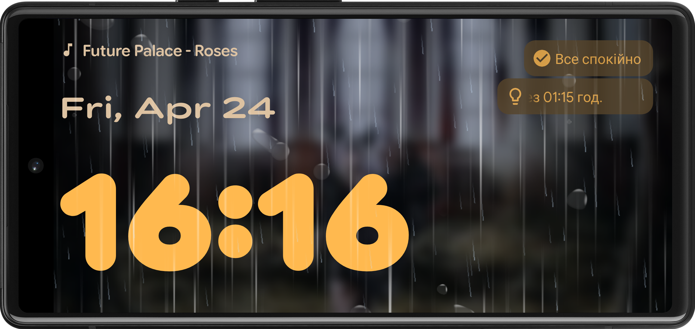

# ClockDesk

**ClockDesk — a second life for your old smartphone as a stylish desk clock.**

ClockDesk is an Android app that turns any old device into a beautiful and functional desk clock. Perfect for bedside tables, work desks, or your kitchen counter.



---

## 🔧 Features

- ⏰ Customizable clock display (font and size)
- 🌅 Dynamic background that mimics the sky using Sunrise/Sunset API
- 🎨 Basic UI customization options
- 🖼️ User-selectable background images
- 🎶 Now Playing widget with Last.fm integration (requires Last.fm API key)

### 📌 Planned Features:
- 🌦️ Weather-aware animated effects for the background (inspired by Android 16 QPR1)
- ⏲️ Timers and additional widgets
- ⚙️ Extended customization settings

---

## ⚙️ Tech Stack

- Language: Kotlin
- IDE: Android Studio
- API: Sunrise/Sunset API

---

## 🚀 Installation

ClockDesk supports devices running **Android 4.4 KitKat** (API 19) or higher.

📦 Download an APK build from releases or clone this repository and build it.

```git clone https://github.com/nx-d1frnt/ClockDesk.git```

---

### 🤝 Contributing
Pull requests and issues are welcome!
I would love to see others contribute to ClockDesk in any of the following ways:

- Improving the codebase
- Designing new themes or UI ideas
- Translating the interface
- Testing on different devices

---

### 📃 License
This project is licensed under the MIT License. See the [LICENSE](./LICENSE) file for details.

