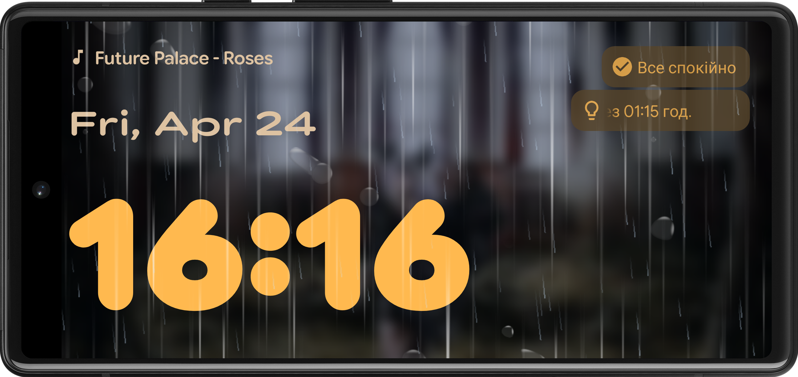

# ClockDesk

**Give your old Android device a second life as a stylish, functional desk clock.**

ClockDesk transforms your idle smartphone or tablet into a beautiful bedside or desk companion. Designed for simplicity and utility, it provides glanceable information through a highly customizable interface while protecting your device's longevity.



---

## ✨ Key Features

### 🕒 Personalized Clock Experience
- **Typography & Style:** Choose from a variety of fonts, add your own and adjust sizes to fit any screen.
- **Fluid Animations:** Smooth transitions and updates for a modern feel.

### 🖼️ Dynamic & Interactive Backgrounds
- **Day/Night Cycle:** Backgrounds evolve based on your local sunrise and sunset times.
- **Weather-Aware Effects:** Live animated effects (Rain, snow, etc.) that react to real-time weather conditions.
- **Deep Customization:** Apply blur, dimming, and custom images.

### 🔌 Smart Chips & Music Integration
- **Smart Chips:** A modular plugin system for glanceable info like weather, battery status, and background progress.
- **Now Playing Widget:** Integrated track info with support for various sources via a plugin architecture.

### 🛡️ OLED Longevity
- **Burn-in Protection:** Intelligent pixel shifting to prevent static image retention on OLED/AMOLED screens.
- **Smart Pixels:** Reduces power consumption and heat by selectively turning off pixels.

---

## 🛠️ Built With

- **Language:** 100% Kotlin
- **Architecture:** Modular, plugin-based system for widgets and music.
- **Libraries:**
  - **Glide:** Advanced image processing and blurring.
  - **AndroidX Palette:** For dynamic UI coloring based on backgrounds.
  - **Volley:** Efficient networking for weather and time data.
  - **Material 3:** Modern design components and theming.

---

## 🚀 Getting Started

### Prerequisites
- **Android Version:** API 23 *(Android 6 Marshmallow)* or higher. 
- **Recommended:** Keep the device connected to a power source for continuous use.

### Installation
1.  Download the latest APK from the [Releases](https://github.com/nx-d1frnt/ClockDesk/releases) section.
2.  Install the APK (ensure "Install from Unknown Sources" is enabled).
3.  Launch **ClockDesk** and customize your view!

### Building from Source
```bash
git clone https://github.com/nx-d1frnt/ClockDesk.git
cd ClockDesk
./gradlew assembleDebug
```

---

## 🤝 Contributing

Contributions are what make the open-source community such an amazing place to learn, inspire, and create. Any contributions you make are **greatly appreciated**.

1. Fork the Project
2. Create your Feature Branch (`git checkout -b feature/AmazingFeature`)
3. Commit your Changes (`git commit -m 'Add some AmazingFeature'`)
4. Push to the Branch (`git push origin feature/AmazingFeature`)
5. Open a Pull Request

---

## 📄 License

Distributed under the MIT License. See `LICENSE` for more information.

---
*Created with ❤️ by nx-d1frnt*
