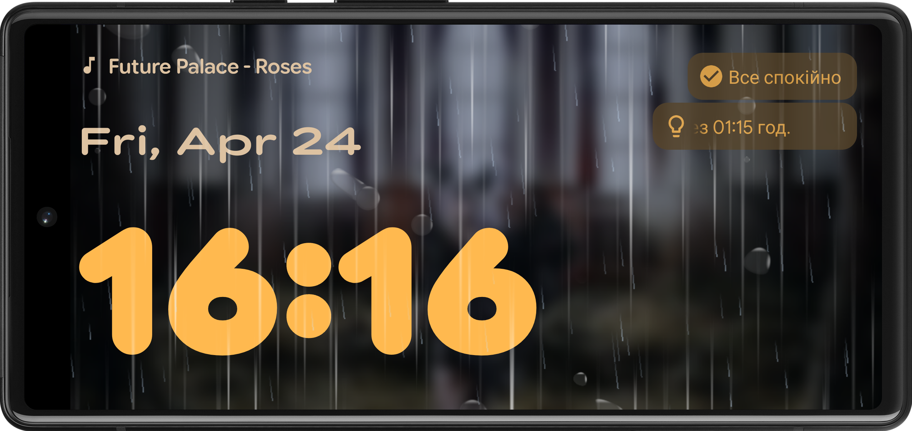

<div align="center">


# ClockDesk

**Give your old Android device a second life as a stylish, ambient desk clock & smart display.**

[](https://github.com/nx-d1frnt/ClockDesk/releases)
[-3DDC84.svg?style=flat-square&logo=android&logoColor=white)](https://developer.android.com)
[](https://developer.android.com)
[](https://kotlinlang.org)
[](LICENSE)

<br />



</div>

---

## 📖 Overview

**ClockDesk** transforms any idle Android tablet or smartphone into a modern, glanceable bedside or workstation companion. Designed with both aesthetics and utility in mind, ClockDesk pairs rich personalization with built-in OLED burn-in prevention and energy-conscious rendering to ensure safe, long-term continuous display use.

---

## ✨ Key Features

### 🕒 Personalized Clock & Typography
- **Multiple Clock Styles:** Choose from clean digital styles, minimal typography, and customizable layouts.
- **Custom Font Engine:** Load your favorite `.ttf` / `.otf` fonts and fine-tune variable font weights and axes.
- **Fluid Visuals & Shaders:** Smooth entrance animations, and ambient shader effects.
- **Dynamic Palette Theming:** Seamlessly extracts dominant and vibrant colors from backgrounds.

### 🖼️ Dynamic & Interactive Backgrounds
- **Day / Night Cycle:** Live astronomical calculation adapting background gradients and moods based on your exact local sunrise and sunset.
- **Weather-Reactive Atmosphere:** Backgrounds that respond visually to real-time local weather conditions (rain, snow, clouds, clear skies).
- **Custom Wallpapers:** Import personal photos with built-in aspect-ratio cropping, configurable blur strength, and dimming controls.

### 🧩 Modular Smart Chips System
- **Glanceable Widgets:** Drag-and-drop customizable chips that display critical information without clutter:
  - ⛅ **Weather Chip:** Live conditions, temperature, and detailed forecast dialogs.
  - ⚠️ **Weather & Battery Alerts:** Severe weather notifications and high-temperature / battery-state warnings.
  - ⏰ **Alarm Chip:** Next scheduled alarm time and countdown.
  - ⏳ **Background Progress:** Track day, month, or year progress at a glance.
  - 🔄 **Update Chip:** Direct notification and changelog when new updates are available.
- **Extensible Plugin Architecture:** Third-party applications can supply custom chips via standard Android intents (`com.nxd1frnt.clockdesk2.ACTION_QUERY_SMART_CHIPS`).

### 🎵 "Now Playing" Music Integration
- **System Media Session:** Automatically detects and displays playback status, track metadata, and album artwork from active media apps (Spotify, Apple Music, YouTube Music, etc.) with playback controls.
- **Last.fm Support:** Native integration to display your live scrobbling activity directly on screen.
- **Modular Music Sources:** Reorder and toggle media providers using the unified plugin system.

### 🛡️ OLED & Screen Longevity
- **Burn-In Protection:** Subtle, periodic pixel shifting to prevent static image retention during continuous 24/7 desk use.
- **Smart Pixels (AMOLED Saver):** Selectively turns off a grid pattern of OLED sub-pixels to drastically cut power draw and heat generation.
- **Power State Optimization:** Automatically adapts update frequencies and rendering overhead when running on battery or in low-power modes.

### 🖥️ Launcher & Kiosk Friendly
- **Home / Kiosk Mode:** Can be set as the default Android Launcher (`HOME` intent) to turn older devices into dedicated smart displays.
- **Interactive Drag-to-Position:** Freely adjust the position of clock and widget elements to fit your setup and stand angle.
- **Settings Backup & Restore:** Export and import your customized configuration with ease.

---

## 🛠️ Tech Stack & Architecture

- **Language:** Kotlin
- **UI & Design:** Material Components 3, AndroidX ConstraintLayout and custom OpenGL Shaders.
- **Image Processing & Graphics:** [Glide](https://github.com/bumptech/glide), [AndroidX Palette](https://developer.android.com/develop/ui/views/graphics/palette-colors), [ColorPickerView](https://github.com/skydoves/ColorPickerView)
- **Networking:** Volley HTTP library with caching for weather and geocoding services
- **Storage & State:** AndroidX Preferences with JSON backup/restore engine

---

## 🚀 Getting Started

### Prerequisites
- **Minimum Android Version:** Android 6.0 Marshmallow (`API 23`) or higher.
- **Recommended Setup:** Keep your device plugged into a dock or charger with landscape orientation enabled.

### Permissions
For the best experience, ClockDesk utilizes:
- **Location (`ACCESS_COARSE_LOCATION` / `ACCESS_FINE_LOCATION`):** Required for automated sunrise/sunset calculation and local weather forecasts.
- **Notification Listener Access:** Required if you want the "Now Playing" widget to read media sessions from apps like Spotify or YouTube Music.

### Installation
1. Download the latest APK file matching your device architecture (or Universal) from the **[Releases](https://github.com/nx-d1frnt/ClockDesk/releases)** page.
2. Allow installation from unknown sources if prompted.
3. Open **ClockDesk**, grant optional permissions, and follow the interactive tutorial to customize your desk clock!

### Building from Source
Ensure you have the Android SDK and JDK 11+ installed:

```bash
# Clone the repository
git clone https://github.com/nx-d1frnt/ClockDesk.git
cd ClockDesk

# Build debug APK
./gradlew assembleDebug

# Output APK location:
# app/build/outputs/apk/debug/
```

---

## 🔌 Developing Plugins

ClockDesk 2.0 features an open plugin contract allowing external apps to provide custom widgets and music sources:

- **Smart Chips Action:** `com.nxd1frnt.clockdesk2.ACTION_QUERY_SMART_CHIPS`
- **Music Plugins Action:** `com.nxd1frnt.clockdesk2.music.PLUGIN`

Implement the plugin intent filters and contracts in your Android app to seamlessly display custom telemetry, IoT metrics, or media feeds on the ClockDesk display.

---

## 🤝 Contributing

Contributions, bug reports, and feature requests are welcome!

1. Fork the Project
2. Create your Feature Branch (`git checkout -b feature/AmazingFeature`)
3. Commit your Changes (`git commit -m 'Add some AmazingFeature'`)
4. Push to the Branch (`git push origin feature/AmazingFeature`)
5. Open a Pull Request

---

## 📄 License

Distributed under the **MIT License**. See [`LICENSE`](LICENSE) for details.

---

<div align="center">
  <sub>Created with ❤️ by <a href="https://github.com/nx-d1frnt">nx-d1frnt</a></sub>
</div>
